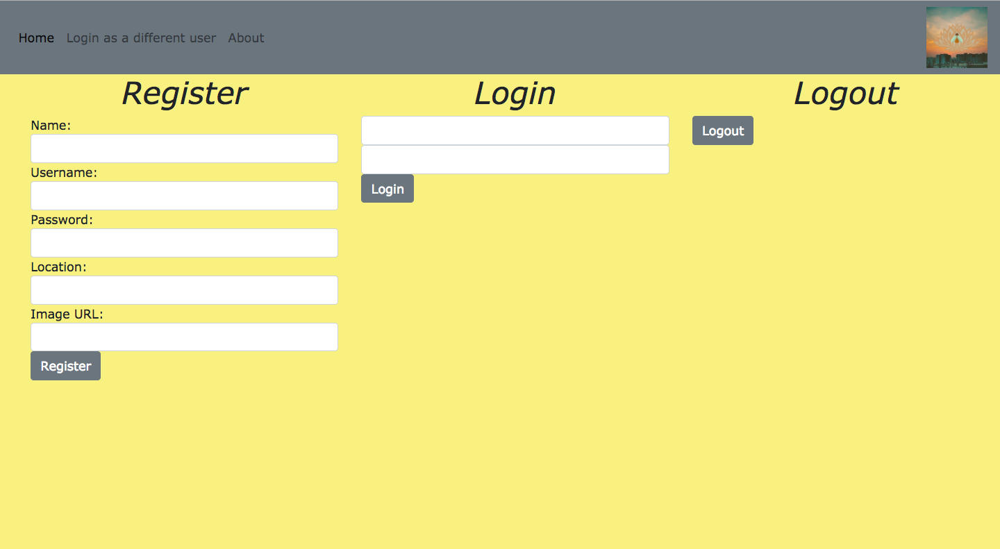

# Unit 2 Project

## Alex Fields and Christine Samarchi

## User Story
This app is intended for anyone ages 18+. This app is designed to help aid you in determining if someone is a suitable to date. It will provide real feedback from people that have dated that individual in order to give you a first hand account of what it is like to be with them. It's Yelp for humans!

### Overview
Our Unit 2 project will be a dating app that will allow people to post reviews on their exes. They can list the good and/or bad qualities and then rate the dating experience. They will be allowed to post one picture of their ex as long as it is a moderate picture (ie no nudity, or anything that could embarrass them).

### Goals
Establish a website that uses controllers and functions to allow user login
Enable user ability to post as many reviews as they like
Keep a login of multiple users
The app will have the following
Login page
Search by state area
Search by name area
Ability to hold user logins
Posting page will host all reviews

### Tertiary Goals
Enable google search api (have code, need to test applicability)
Top poster notifications
Most reviewed person area

### Wireframes
Homepage: https://wireframe.cc/i5poJU
Create Login: https://wireframe.cc/cU9AvW
Main page: https://wireframe.cc/lv5XtO
Profile Page: https://wireframe.cc/9391xd
State Search Page:  https://wireframe.cc/WQCJf2
Location Show: https://wireframe.cc/d6oeSy
Person Reviewed Page: https://wireframe.cc/QV9jTS

### Technologies used:
HTML
CSS
JAVASCRIPT
GitHub
Mongoose
Node
Jquery
NPM: Async
NPM: Method-Override
NPM: Body-Parser
NPM: EJS
